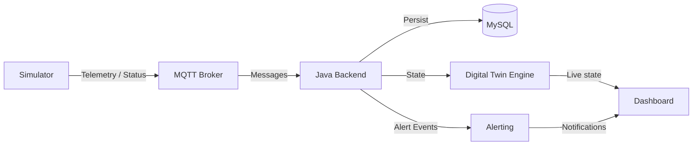
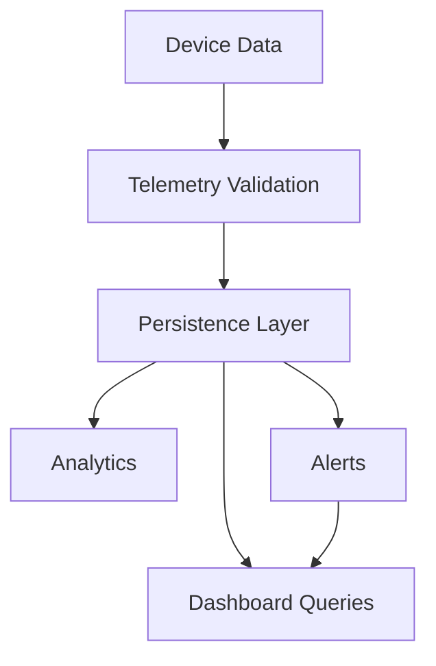
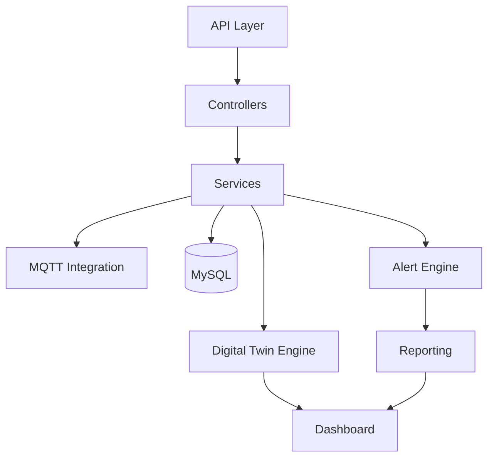

# Architecture

## 1. High-Level Architecture


## 2. Data Flow


## 3. MQTT Flow
```mermaid
flowchart LR
    SIM[Simulated Device]
    TOPIC[MQTT Topics]
    BROKER[MQTT Broker]
    SUB[Backend Consumer]
    VALID[Validation]
    PROC[Processing]

    SIM -->|campus/{building}/{room}/{device}/data| TOPIC
    SIM -->|campus/{building}/{room}/{device}/status| TOPIC
    TOPIC --> BROKER
    BROKER --> SUB
    SUB --> VALID --> PROC
```

## 4. Backend Flow


## 5. Workflow
Simulator
↓
MQTT
↓
Java Backend
↓
MySQL
↓
Digital Twin
↓
Dashboard
↓
Alerts

## 6. Architectural Principles
- decouple simulation, messaging, processing, and visualization
- centralize domain rules in backend services
- preserve campus hierarchy and operational relationships in the digital twin model
- maintain clear notification and reporting pathways for alerts and trends
